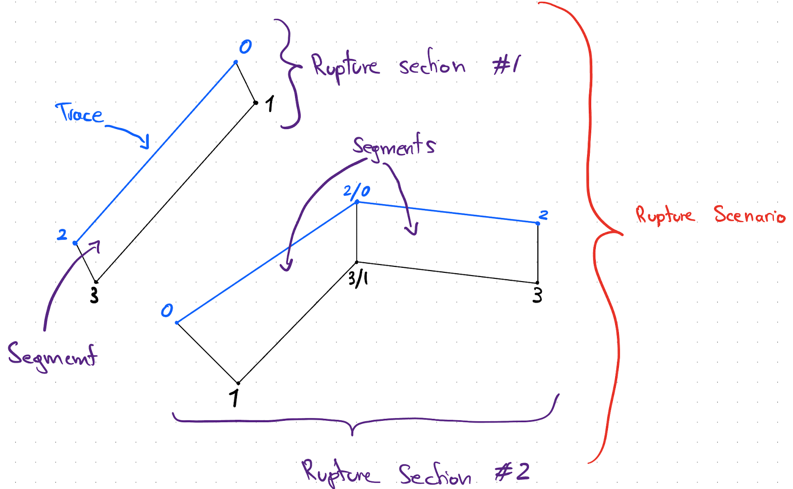
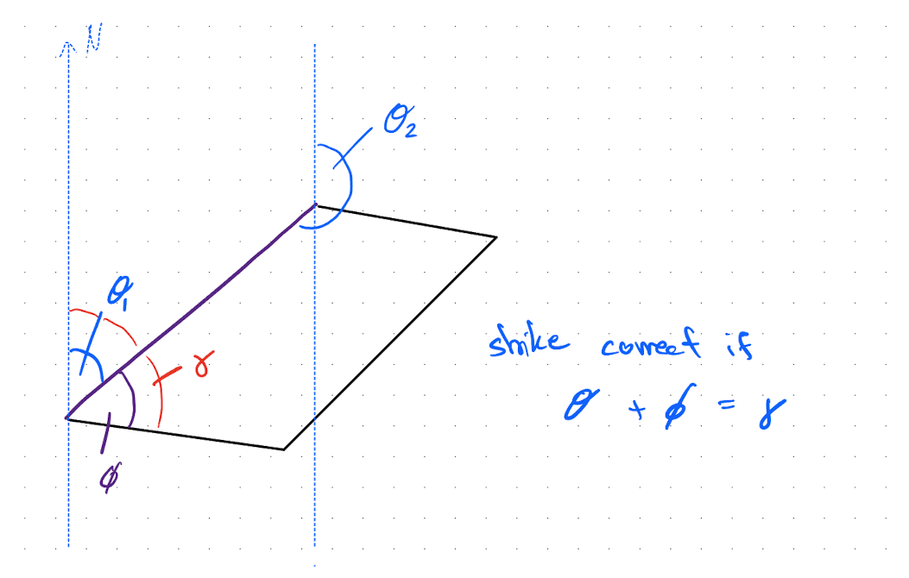
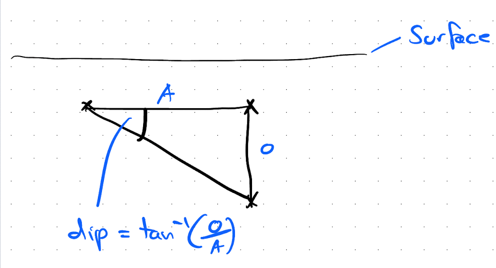
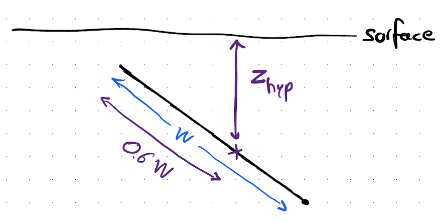

## Distance & Source Property Calculation Notes

[toc]

### Introduction

This documentation gives an overview of how the distances calculations are done, both in terms of the mathmatical and the implemention details. 

The current state of this distance calculation is currently somewhat specific for the 2022 NSHM source model, however in the future the code will be generalised to allow for other data sources.

It is also worth noting that the primary use case of this distance calculation, and our GMHazard implementation in general, is for the single site seismic hazard calculation. In other words the case of computing results for many sites at once is not considered, however is obviously still possible, its just not optimised for that use case.

### Definitions

Most of these term definitions are based on the terms used in the NSHM data files, which in turn were written for OpenQuake usage.

**Rupture Scenario**
Represents a rupture scenerio considered as part of the NSHM. Is made up out of one or more rupture sections.

**Rupture Section**
Represent a single continous (i.e. no gaps) section of the rupture. Same as fault trace. 
Made up of segments. A rupture section is continuous, i.e. there are no gaps between the segments.

Note: A rupture section can be used in multiple rupture scenarios.

**Rupture Segement**
Represents a quadrilateral portion of the fault, defined by 4 lat/lon points. Is generally rectangular/parallelogram like in shape, however the only assumption that is made is that it is a convex quadrilateral. 
https://en.wikipedia.org/wiki/Quadrilateral

Note: This is a GMHazard 2 concept. NSHM rupture definitions just use rupture sections (defined by $4 + ((N - 1) * 2)$ points)

The 4 points that define the segment are assumed to be in the following order 
[Trace Point 1, Down Dip Point 1, Trace Point 2, Down Dip Point 2]

Note II: The order of the points is not related to strike, i.e. strike has to be computed based on down dip direction (see below)

**Diagram of a rupture scenario:**

The below diagram is a hypothetical rupture scenario made up of 2 rupture sections. The first rupture section consists of a single segment, defined by 4 points. The second rupture section is made up of 2 segments.

### Coordinate system

All computation of distance values and source properties are done in a Cartesian coordinate system. Given that this code is (currently) specifically for NZ applications, the [NZTM coordinate system](https://www.linz.govt.nz/guidance/geodetic-system/coordinate-systems-used-new-zealand/projections/new-zealand-transverse-mercator-2000-nztm2000) is used.

### Computation of source properties

#### Notation

- **Segment corner points:** $P_0, P_1, P_2, P_3$, with $P_0$ and $P_2$ defining the fault trace
- **Surface projection of segment points:** $P_0^{s}, P_1^{s}, P_2^{s}, P_3^{s}$

#### Segment

**Area:** The segment area is computed as follows 
$$
A_{Segment} = 0.5 * ||(P_1 - P_0) \times (P_2 - P_0)|| + 0.5 * ||(P_1 - P_3) \times (P_2 - P_3)||
$$
The magnitude of the cross product between two vectors is the area of the parallelogram they define (https://en.wikipedia.org/wiki/Cross_product#Geometric_meaning). Which in this case is used to compute the area of the two triangles that make up the rupture segment.

**Strike:** The strike for a segment is computed as follows:

- Compute both possible strike unit vectors and their bearing
  $$
  \hat{s_1} = \frac{P_0^{s} - P_2^{s}}{||P_0^{s} - P_2^{s}||}  \\
  \theta_1 = arctan2(s_{1, x}, s_{1, y}) * \frac{180}{\pi} \mod{360} \\
  \hat{s_2} = \frac{P_2^{s} - P_0^{s}}{||P_2^{s} - P_0^{s}||} \\
  \theta_2 = arctan2(s_{2, x}, s_{2, y}) * \frac{180}{\pi} \mod{360}
  $$
  

- Compute the surface projection of the down dip unit vector for $P_0$
  $$
  \hat{d} = \frac{P_1^{s} - P_0^{s}}{||P_1^{s} - P_0^{s}||}
  $$

- Compute the bearing of the down dip vector
  $$
  \phi = arctan2(d_{x}, d_{y}) * \frac{180}{\pi} \mod{360}
  $$
  Note: [Arctan](https://en.wikipedia.org/wiki/Atan2) is defined as $arctan2(y,x)$ and computes the angle with respect to the x-axis. Hence to compute the angle with respect to the y-axis, the arguments are swapped.

- Compute the angle between the strike vector, $\hat{s_1}$ and the down dip vector, $\hat{d}$
  $$
  \gamma = cos^{-1}(\hat{s_1} \cdot \hat{d}) * \frac{180}{\pi} \mod 360
  $$
  

- If $\theta_1 + \phi = \gamma$ then the correct strike is $\hat{s_1}$ and  $\theta_1$ otherwise $\hat{s_2}$ and  $\theta_2$ 

**Dip:** Is computed as follows:

- Compute the dip for both endpoints of the segments, i.e.
  

- The segment dip is then given by
  $$
  \delta = \frac{\delta_1 + \delta_2}{2}
  $$

**$\mathbf{Z_{Tor}}$**: Is computed as follows
$$
Z_{Tor} = \frac{d_1 + d_2}{2}
$$
where $d_1$ and $d_2$ are the depth of the two trace endpoints

**$\mathbf{Z_{Depth}}$:** Computation is based on Mai et al. (2015), which suggested for the hypocentre location to be 60% down-dip Width, i.e.

- Compute the down-dip width at both trace endpoints
  $$
  w_1 = ||P_0 - P_1|| \\
  w_2 = ||P_2 - P_3||
  $$

- Compute the segment width as 
  $$
  W = \frac{w_1 + w_2}{2}
  $$

- Compute the mid-point along the trace and bottom edge, and then compute the down dip vector
  $$
  P_{TraceMid} = \frac{P_0 + P_2}{2} \\
  P_{BottomMid} = \frac{P_0 + P_2}{2} \\
  \hat{d}_{Mid} = \frac{P_{BottomMid} - P_{TraceMid}}{||P_{BottomMid} - P_{TraceMid}||}
  $$

- Compute the "hypocentre" location
  $$
  H = P_{TraceMid} + 0.6 * W * \hat{d}_{Mid}
  $$

- Return the depth of location, $H_z$

#### Section

**Area, $\mathbf{A_{Section}}$:** Simply the sum of the segment areas that make up the section

Dip, $\mathbf{Z_{Tor}}$, $\mathbf{Z_{Depth}}$ : These are simply the area weighted sum of the segments, i.e.
$$
P = \sum^N_{i=1} \frac{A_{Segment, i}P_{i}}{A_{Section}}
$$
​	where $P$ is the property of interest 

